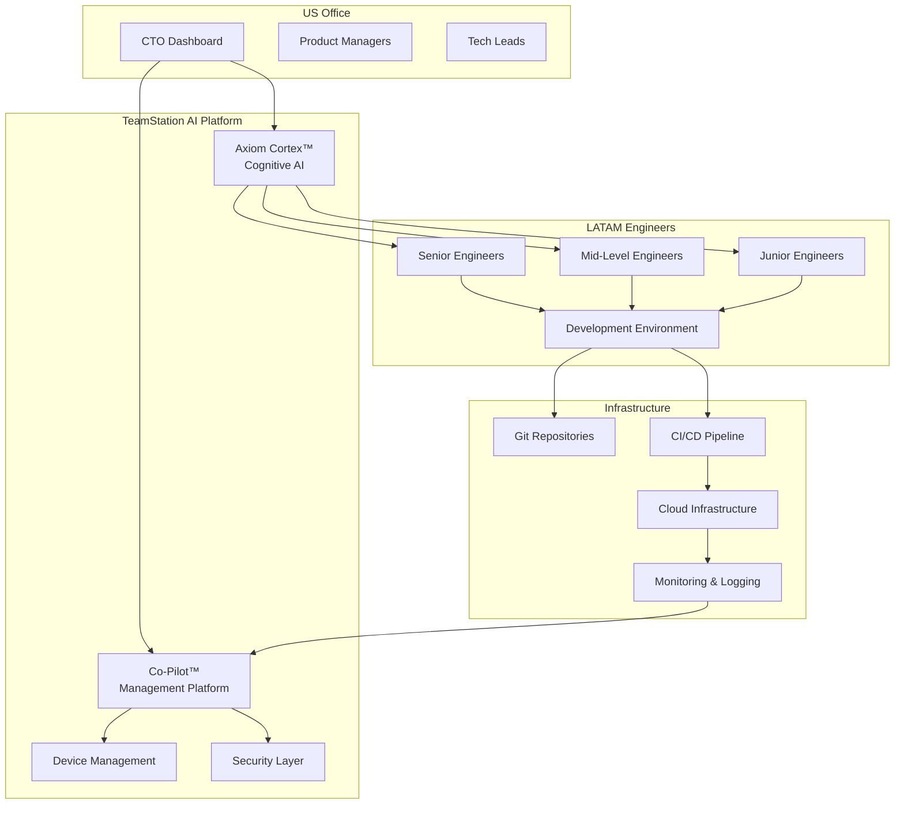
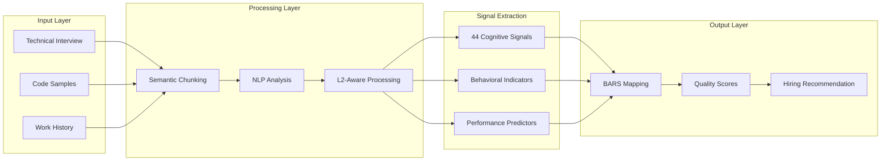
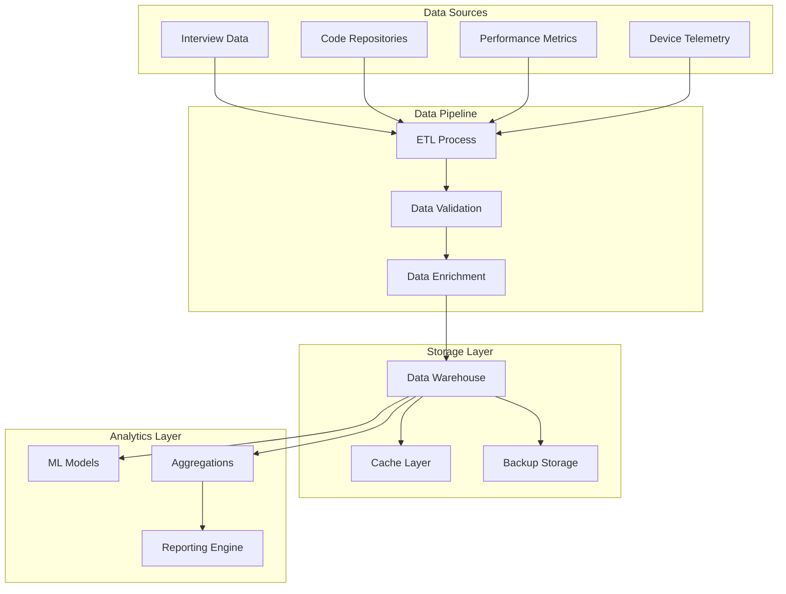

# Architecture Overview

## System Architecture

### High-Level Platform Architecture



### Axiom Cortex™ Evaluation Architecture



## Technical Integration Points

### Identity & Access Management

#### Single Sign-On (SSO) Integration
```yaml
Provider: Okta / Azure AD / Google Workspace
Protocol: SAML 2.0 / OAuth 2.0 / OpenID Connect
Scopes:
  - User Profile
  - Group Membership
  - Device Authorization
```

#### Role-Based Access Control (RBAC)
```yaml
Roles:
  - CTO: Full platform access, all metrics
  - Tech Lead: Team metrics, hiring pipeline
  - Engineer: Personal dashboard, peer reviews
  - HR: Hiring pipeline, compliance reports
```

### Development Environment Integration

#### Version Control Integration
```yaml
Supported Platforms:
  - GitHub Enterprise
  - GitLab Enterprise
  - Bitbucket Enterprise
  - Azure DevOps

Integration Points:
  - PR/MR Review Metrics
  - Code Quality Analysis
  - Commit Frequency Tracking
  - Collaboration Signals
```

#### CI/CD Pipeline Integration
```yaml
Supported Platforms:
  - Jenkins
  - GitHub Actions
  - GitLab CI
  - CircleCI
  - Azure Pipelines

Metrics Collected:
  - Build Success Rate
  - Deployment Frequency
  - Lead Time for Changes
  - Mean Time to Recovery
```

### Communication Platform Integration

#### Slack Integration
```yaml
Capabilities:
  - Performance notifications
  - Hiring pipeline updates
  - Team satisfaction surveys
  - Automated check-ins

Bot Commands:
  - /teamstation status
  - /teamstation metrics
  - /teamstation review [engineer]
```

#### Microsoft Teams Integration
```yaml
Capabilities:
  - Dashboard widgets
  - Meeting insights
  - Collaboration scoring
  - Document sharing metrics
```

## Security Architecture

### Network Security

#### Zero Trust Architecture
```yaml
Principles:
  - Never trust, always verify
  - Least privilege access
  - Micro-segmentation
  - Continuous monitoring

Implementation:
  - VPN + MFA for all access
  - Device certificates
  - Network access control
  - Behavioral analytics
```

#### Data Encryption
```yaml
In Transit:
  - TLS 1.3 for all connections
  - Certificate pinning
  - Perfect forward secrecy

At Rest:
  - AES-256 encryption
  - Key rotation every 90 days
  - Hardware security modules (HSM)
```

### Device Management

#### Mobile Device Management (MDM)
```yaml
Capabilities:
  - Device enrollment
  - Application management
  - Security policy enforcement
  - Remote wipe capabilities

Supported Platforms:
  - macOS (primary)
  - Windows 10/11
  - Ubuntu LTS
  - iOS/Android (BYOD)
```

#### Endpoint Protection
```yaml
Components:
  - Anti-malware
  - Behavioral analysis
  - Application whitelisting
  - USB control

Monitoring:
  - Real-time threat detection
  - Compliance reporting
  - Security event logging
```

## Data Architecture

### Data Flow Architecture



### Data Classification

#### Sensitivity Levels
```yaml
Public:
  - General documentation
  - Marketing materials
  - Public metrics

Internal:
  - Team structure
  - Process documentation
  - Non-sensitive metrics

Confidential:
  - Individual performance
  - Salary information
  - Interview feedback

Restricted:
  - Personal information
  - Security configurations
  - Compliance data
```

## Performance & Scalability

### System Performance Targets

| Component | Target | Measurement |
|-----------|--------|-------------|
| **Dashboard Load Time** | < 2 seconds | 95th percentile |
| **API Response Time** | < 500ms | 99th percentile |
| **Report Generation** | < 30 seconds | Complex reports |
| **Data Sync Latency** | < 5 minutes | Real-time metrics |

### Scalability Architecture

#### Horizontal Scaling
```yaml
Components:
  - Load balancers (ALB/NLB)
  - Auto-scaling groups
  - Container orchestration (EKS)
  - Database read replicas

Scaling Triggers:
  - CPU utilization > 70%
  - Memory utilization > 80%
  - Request queue length > 100
  - Response time > 1 second
```

#### Capacity Planning
```yaml
Current Capacity: 1000 engineers
Growth Plan: 200% annually
Resource Requirements:
  - Compute: 2x current capacity
  - Storage: 3x current capacity
  - Network: 1.5x current bandwidth
```

---

**Next Steps:**
1. [Review Integration Guide](integration.md)
2. [Implement Security Framework](security.md)
3. [Download Architecture Diagrams](../resources/pdf-downloads.md#integration-architecture)